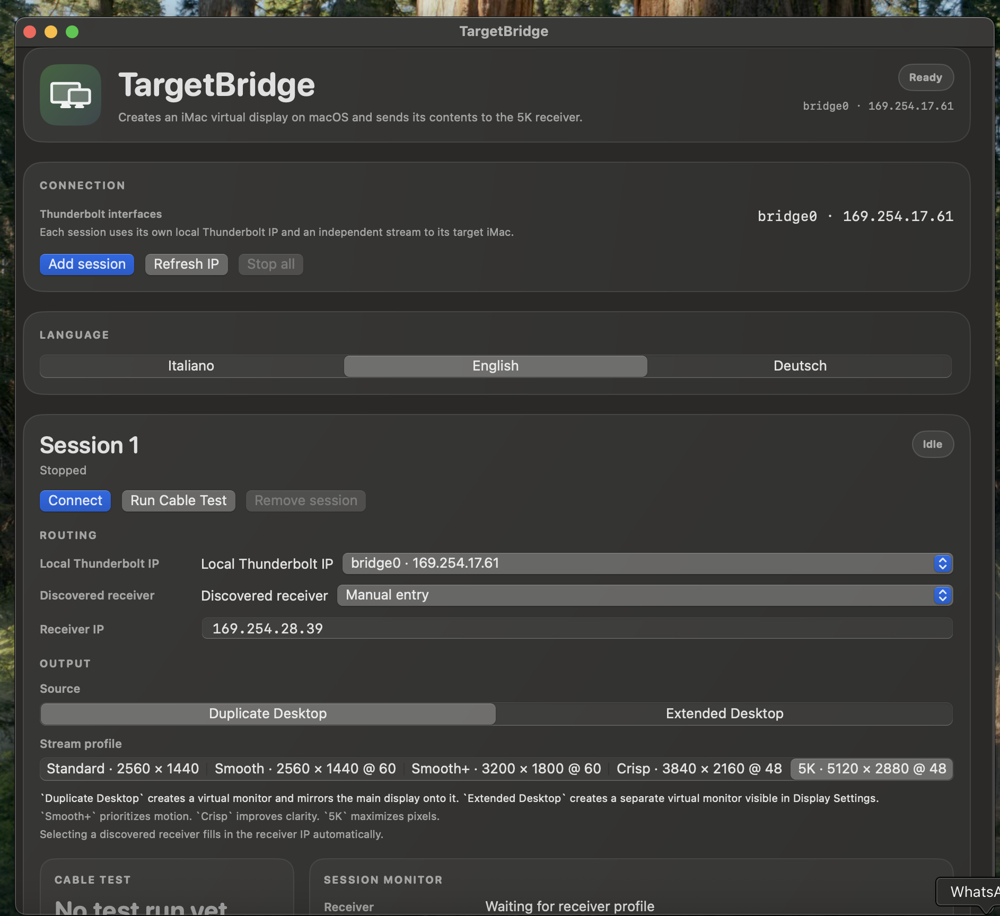
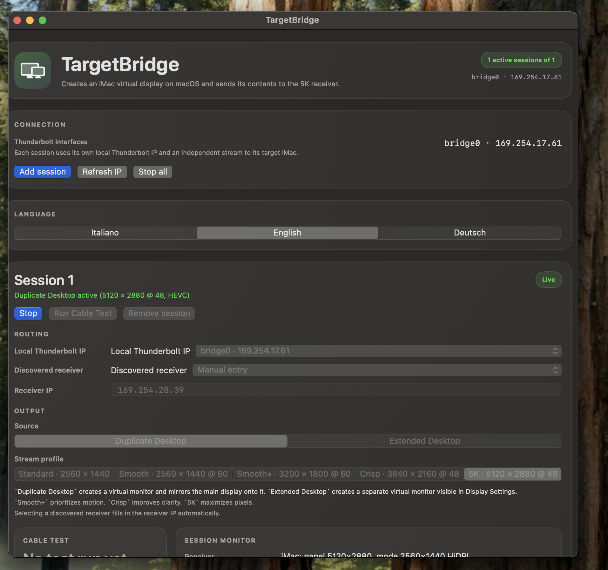
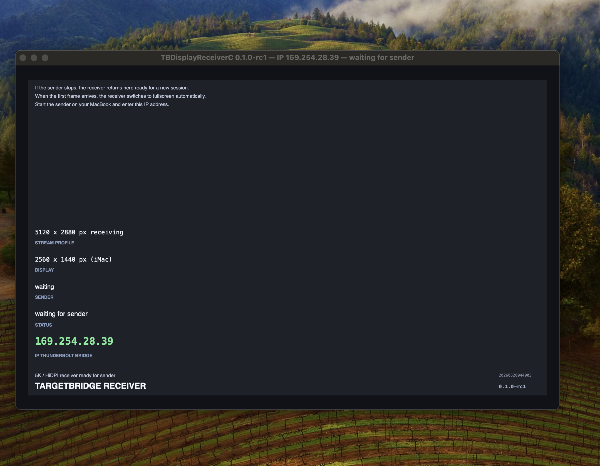
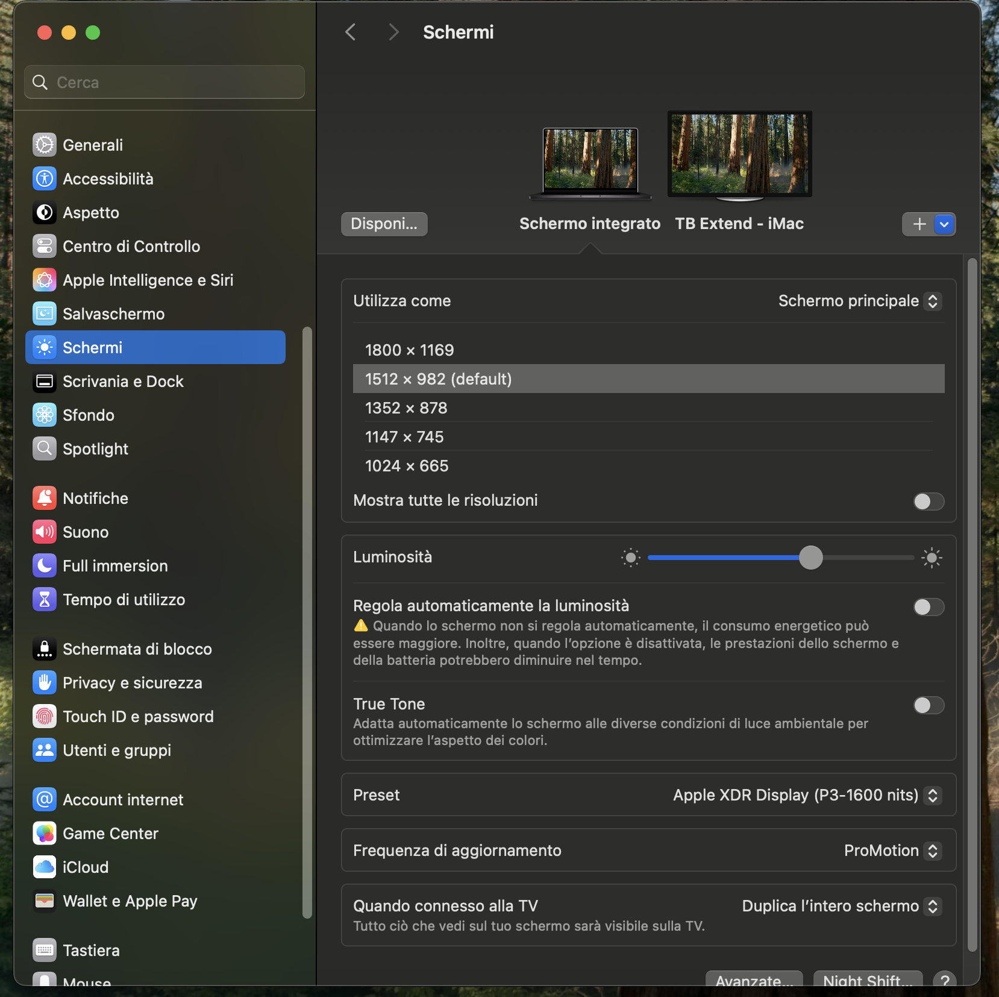
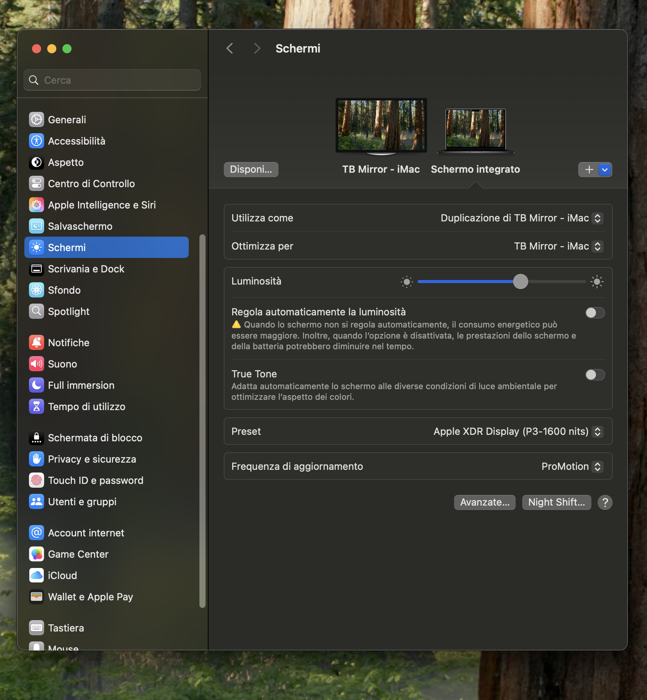

# TargetBridge

Apple dropped Target Display Mode in late 2014 with the 5K iMac — and it never came back.

TargetBridge brings it back via software, streaming your screen at up to 5K over a direct Thunderbolt connection, e.g. to an iMac.

It's free and open source software, no subscription and no dongle required.

If it is useful to you, spread the news and give us a ⭐ on GitHub.

Sponsoring the TargetBridge project is also very welcome:

[](https://github.com/sponsors/swellweb)

## Features

- a sender can stream either an extended virtual display or a mirror of the sender display
- one sender can stream to multiple receiver machines (using multiple TB cables)
- multiple available stream profiles from 2560x1440 to 5120x2880 at various refresh rates
- uses low latency, high throughput thunderbolt connections
- uses Apple Silicon Media Engines for fast H.264/HEVC encoding
- automatic receiver discovery via Bonjour
- remembers extended-display arrangement per receiver

## Requirements

- Sender: Apple Silicon Mac (M1 or later), macOS 14 Sonoma or later
- Receiver: Intel or Apple Silicon Mac, macOS 11 Big Sur or later
- Thunderbolt cable
- see also [Hardware.md](docs/Hardware.md) for more hardware information

## Download

**[→ Download latest release (pre-built apps, no Xcode needed)](https://github.com/swellweb/targetBridge/releases/latest)**

- `TargetBridge-arm64.app.zip` — Sender (for Apple Silicon Macs)
- `TargetBridge-Receiver-arm64.app.zip` — Apple Silicon Receiver (use machine as monitor for sender)
- `TargetBridge-Receiver-x86_64.app.zip` — Intel Receiver (use machine as monitor for sender)

Unzip and double-click. On first launch, grant Screen Recording permission to the sender.

If you build from source, app outputs go into `build/` folder.

> **"App is damaged" warning?** macOS quarantines unsigned apps downloaded from the browser. Run this in Terminal, then try again:
> ```bash
> xattr -cr ~/Downloads/TargetBridge-arm64.app
> xattr -cr ~/Downloads/TargetBridge-Receiver-arm64.app
> xattr -cr ~/Downloads/TargetBridge-Receiver-x86_64.app
> ```

## Extended Desktop

For an extended desktop, choose `Extended display` on the sender before connecting. After the virtual display appears, open macOS **System Settings → Displays → Arrange** on the sender Mac and position the external display where you want it. TargetBridge now reuses the last saved extended-display position for the same receiver when possible.

If the receiver does not fill the iMac panel or the cursor/desktop feels scaled incorrectly, select the external TargetBridge display in macOS Display Settings and choose the matching resolution. For the 27-inch 5K iMac path, use a high-clarity stream profile such as `Crisp` or `5K` with the external display set to the matching 2560 × 1440 HiDPI mode.

## Quick start

- Italian: [docs/QuickStart-IT.md](docs/QuickStart-IT.md)
- English: [docs/QuickStart-EN.md](docs/QuickStart-EN.md)
- 中文: [docs/QuickStart-ZH.md](docs/QuickStart-ZH.md)
- Translation guide: [docs/Translations.md](docs/Translations.md)

## Screenshots

**Sender (Apple Silicon Mac) — multi-session dashboard:**


**Sender — active mirrored stream (5K, HEVC):**


**Receiver (Intel iMac) — waiting for sender:**


**macOS Displays — extended desktop target:**


**macOS Displays — mirrored desktop target:**

